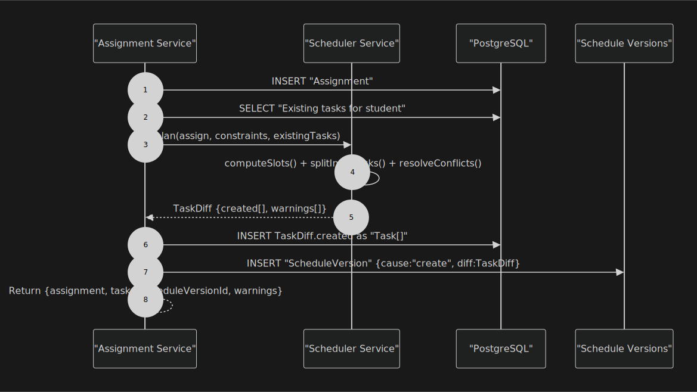
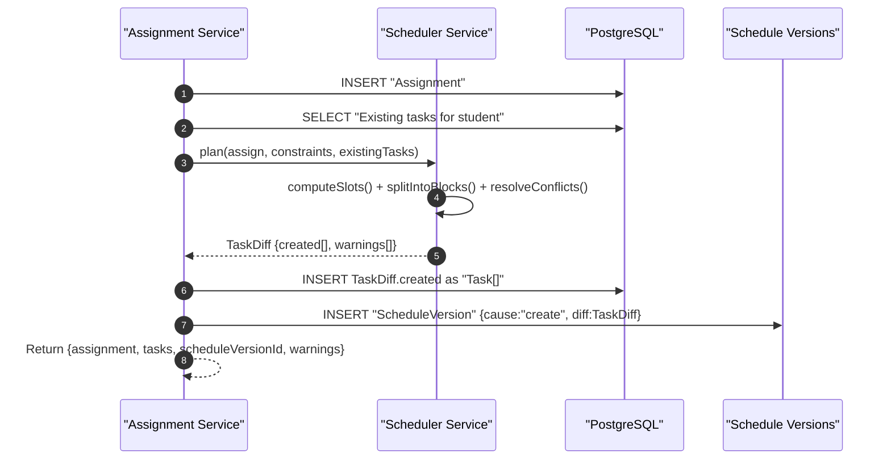
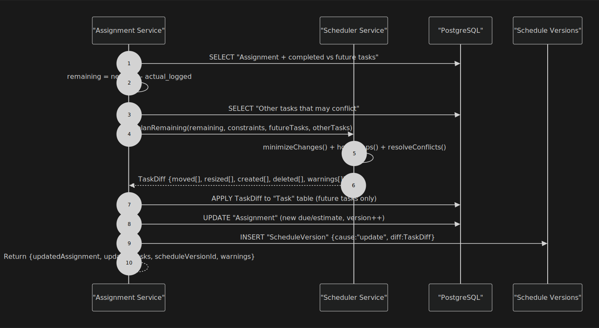
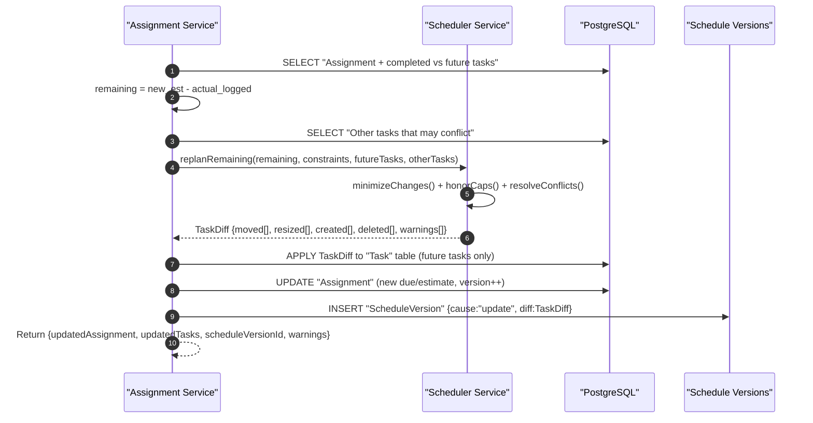
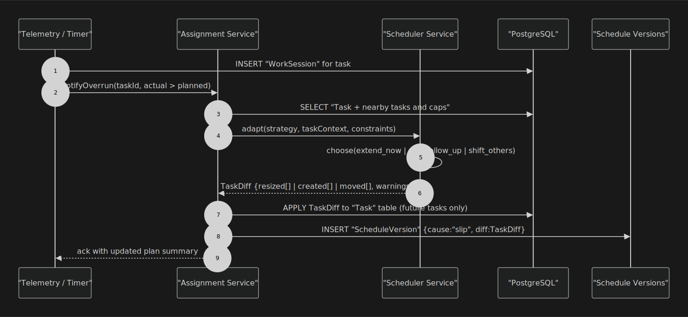
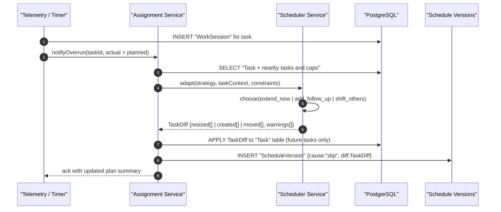

# Scheduler Sequence Diagrams

This document contains extracted sequence diagrams from **sched-diag.pdf**.

## 1. Plan New Assignment

---

## 2. Replan on Update

---

## 3. Adapt on Overrun (Execution Feedback → Heal Plan)

